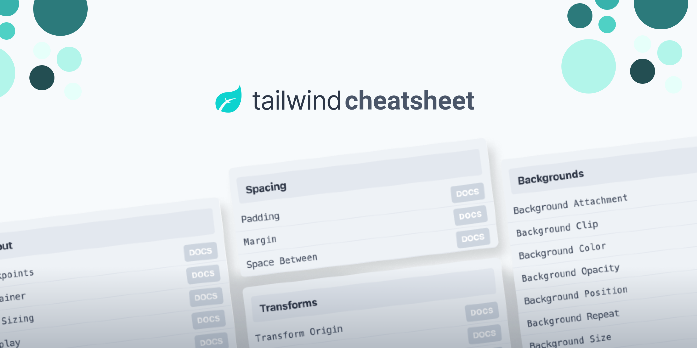

<p align="center">
    

## Tailwindcomponents Cheatsheet]
This repo content a cheatsheet page from [tailwindcomponents.com](https://tailwindcomponents.com/cheatsheet/), it's a react base app build with typescript.

<a href="https://github.com/tailwindcomponents/cheatsheet/blob/main/LICENSE">
    
</a>

<a href="https://github.com/tailwindcomponents/cheatsheet/stargazers">
    
</a>

<a href="https://twitter.com/TwComponents">
    
</a>

## Project setup
```
yarn install
```

### Compiles and hot-reloads for development
```
yarn start
```

### Compiles and minifies for production
```
yarn build
```
